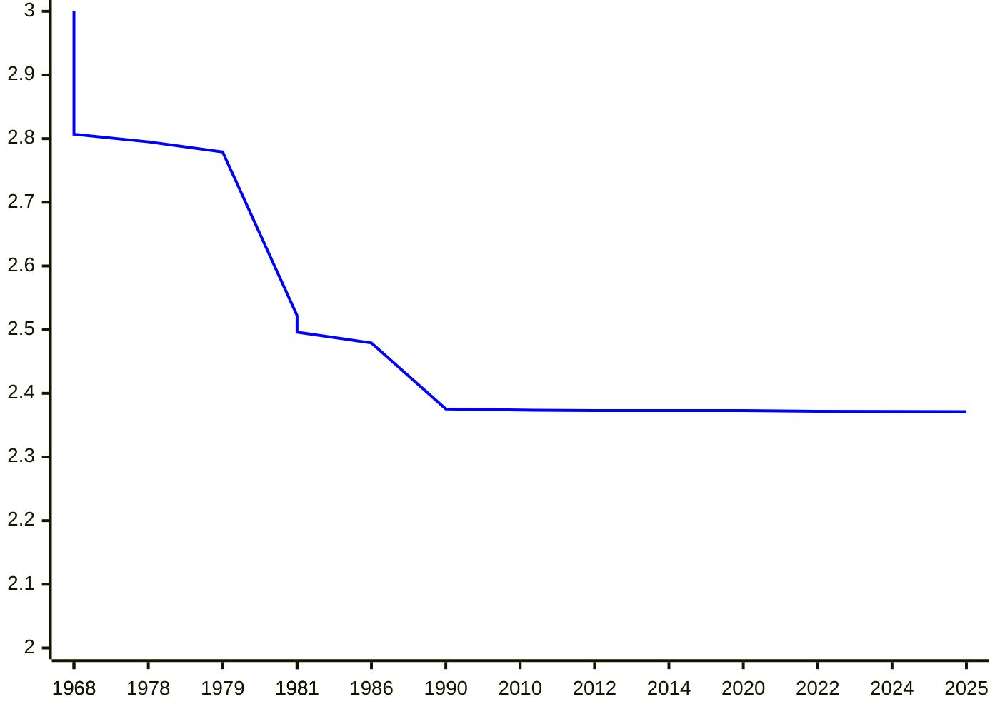
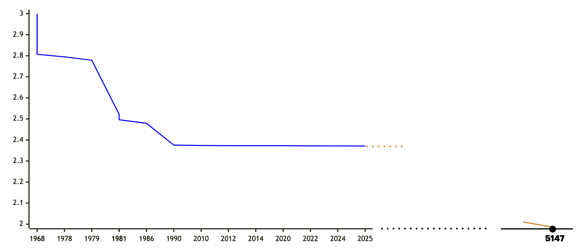

# Error-Correction of Matrix Multiplication Algorithms

Shuichi Hirahara (National Institute of Informatics)

[Nobutaka Shimizu](https://sites.google.com/view/nobutaka-shimizu/home) (Institute of Science Tokyo)

STOC2025

---
layout: top-title
color: amber-light
---

::title::

# Matrix Multiplication

::content::

Given two matrices $A, B \in \F^{n\times n}$, compute their product $AB$ (over a finite field $\F$).

- A long line of works presented fast algorithms. <v-click> The exponent $\omega$ improves by **0.0046** over **35** years.</v-click>

| year | $\omega$ |  authors |
|:--:|:--|:--|
| 1968 | $2.807$ | [Strassen](https://link.springer.com/article/10.1007/BF02165411) |
| 1978 | $2.795$ | [Pan](https://ieeexplore.ieee.org/document/4567976) |
| 1979 | $2.779$ | [Bini, Capovani, Romani, Lotti](https://www.sciencedirect.com/science/article/pii/0020019079901133) |
| 1981 | $2.522$ | [Schönhage](https://epubs.siam.org/doi/10.1137/0210032) |
| 1981 | $2.517$ | [Romani](https://epubs.siam.org/doi/10.1137/0211020) |

|year | $\omega$ | authors |
|:--:|:--|:--|
| 1981 | $2.496$ | [Coppersmith, Winograd](https://ieeexplore.ieee.org/document/4568320) |
| 1986 | $2.479$ | [Strassen](https://ieeexplore.ieee.org/document/4568194) |
| **1990** | $2.3755$ | [Coppersmith, Winograd](https://www.sciencedirect.com/science/article/pii/S0747717108800132?via%3Dihub) |
| 2010 | $2.3737$ | [Stothers](https://era.ed.ac.uk/handle/1842/4734) |
| 2012 | $2.3729$ | [Williams](https://dl.acm.org/doi/10.1145/2213977.2214056) |

| year | $\omega$ | authors |
|:--:|:--|:--|
| 2014 | $2.3728639$ | [Le Gall](https://dl.acm.org/doi/10.1145/2608628.2627493) |
| 2020 | $2.3728596$ | [Alman, Williams](https://theoretics.episciences.org/14213) |
| 2022 | $2.371866$ | [Duan, Wu, Zhou](https://ieeexplore.ieee.org/document/10353208) |
| 2024 | $2.371552$ | [Williams, Xu, Xu, and Zhou](https://epubs.siam.org/doi/10.1137/1.9781611977912.134) |
| **2025** | $2.371339$ | [Alman, Duan, Williams, Xu, Xu, and Zhou](https://epubs.siam.org/doi/10.1137/1.9781611978322.63) |

  
---
layout: top-title
color: amber-light
---

::title::

# Computational Complexity of Matrix Multiplication

::content::

---
layout: top-title
color: amber-light
---

::title::

# Computational Complexity of Matrix Multiplication

::content::

If the current improvement rate (0.0046 / 35 yrs) continues, we need 3122 more years to reach $O(n^2)$ time.

<figure>

</figure>

---
layout: top-title
color: amber-light
---

::title::

# Approximate Matrix Multiplication

::content::

Given two **random** matrices $A,B\sim\F^{n\times n}$ as input, compute any matrix $C\in\F^{n\times n}$ that agrees with $AB$ on at least $\textcolor{c2185b}{\alpha}\cdot n^2$.

<v-clicks>

- $\alpha = 1$: the usual (average-case) matrix multiplication

- $\alpha = \frac{1}{\abs{\F}}$ is easy (just output the all-zero matrix)

- "Non-trivial algorithm": achieves $\alpha \ge \frac{1}{\abs{\F}} + \varepsilon$

Can we achieve a non-trivial $\alpha$ in $\widetilde{O}(n^2)$ time?

- This talk: $\widetilde{O}(\cdot)$ hides a $\polylog(n)$ factor.

</v-clicks>

---
layout: top-title
color: amber-light
---

::title::

# Practical Situation

::content::

- Many fast matrix multiplication algorithms are impractical
  - Huge constant factors (not faster than Strassen until $n>10^{155}$ <a href="https://epubs.siam.org/doi/10.1137/1.9781611978322.61" class="cite-reference">\[Alman, Yu, 2025\]</a>)

<v-clicks>

- Matrix multiplication algorithms using physical systems (with practical considerations)
  - Water flow <a href="https://drops.dagstuhl.de/entities/document/10.4230/LIPIcs.ITCS.2024.96" class="cite-reference">\[Valinat, 2024\]</a>
  - Thermodynamic systems <a href="https://openreview.net/forum?id=6flkWTzK2H" class="cite-reference">\[Coles et al, 2023\]</a>
  - Optical devices <a href = "https://www.nature.com/articles/s41377-022-00717-8" class="cite-reference">\[Zhou et al, 2022\]</a>

  These algorithms may have **errors** due to white noise in physical systems (solving approximate matrix multiplication).

</v-clicks>

---
layout: top-title
color: amber-light
---

::title::

# Problem Setting (Formal)

::content::

The **agreement** of two matrices $C,D\in\mathbb{F}^{n\times n}$ is defined as

$$
  \begin{align*}
    \agr(C,D) &:= \Pr_{i,j\sim[n]}[C(i,j) = D(i,j)].
  \end{align*}
$$

<v-clicks>

- **Approximate Matrix Multiplication**: Given $A,B\in\mathbb{F}^{n\times n}$, compute a matrix $C$ such that $\agr(C,AB)\ge \alpha$.
- When $\alpha=1$, all entries are computed correctly for all instances.

An algorithm $M$ is said to have **average agreement $\alpha$** if
$$
\Exp_{A,B\sim\mathbb{F}^{n\times n}}[\agr(M(A,B),AB)] = \Pr_{\substack{A,B\sim[n]\\ i,j\sim[n]}}[M(A,B)_{i,j}=(AB)_{i,j}]\ge \alpha.
$$
 
 

 
</v-clicks>

---
layout: top-title
color: amber-light
---

::title::

# Main Result 1: Uniform Reduction

::content::

For any $\alpha\in(0,1]$, consider a finite field of size $\abs{\F}>10n/\alpha^2$.
If there exists a $T(n)$-time algorithm with average agreement $\alpha$,
then there exists an $\widetilde{O}(T(n)\poly(1/\alpha) \cdot \log(\abs{\F}))$-time algorithm that solves matrix multiplication.

<v-clicks>

- $\exists$ algo with agreement $\alpha$ $\Rightarrow$ $\exists$ algo with agreement $1$.

Let $\varepsilon\in(0,1]$ be a constant and $\F$ be any finite field of constant prime size.
If there exists a $T(n)$-time algorithm with average agreement $\alpha\ge \frac{2}{\abs{\F}}+\varepsilon$,
then there exists a $\widetilde{O}_{\abs{\F},\varepsilon}(T(n))$-time algorithm that solves matrix multiplication over $\F$.

- Hidden constant factor is extremely large: $2^{2^{\poly(\abs{\F}/\varepsilon)}}$
- $\alpha\ge \frac{\textcolor{c2185b}{2}}{\abs{\F}}+\varepsilon$ is not optimal

</v-clicks>

---
layout: top-title
color: amber-light
---

::title::

# Main Result 2: Nonuniform Reduction with Optimal $\alpha$

::content::

Let $\varepsilon\in(0,1]$ be a constant and $\F$ be any finite field of constant prime size.
If there exists a circuit $C$ of size $S$ that has average agreement $\alpha\ge \frac{1}{\abs{\F}}+\varepsilon$,
then there exists a circuit $C'$ of size $\widetilde{O}_{p,\varepsilon}(S)$ that solves matrix multiplication over $\F$.

Moreover, we can construct $C'$ in time $O_{p,\varepsilon}(n^3)$ given $C$.

<v-clicks>

- $\exists$ circuit $C$ with $\textcolor{c2185b}{\alpha\ge\frac{1}{\abs{\F}}+\varepsilon}$ $\Rightarrow$ $\exists$ circuit $C'$ with $\textcolor{c2185b}{\alpha=1}$.
- Reduction with poly-time preprocessing
- Proof is based on XOR Lemma
  - fundamental result in average-case complexity

</v-clicks>

---
layout: top-title
color: amber-light
---

::title::

# Related Results

::content::

- <a class="cite-reference" href="https://drops.dagstuhl.de/entities/document/10.4230/LIPIcs.APPROX/RANDOM.2024.34">\[Gola, Shinkar, Singh, RANDOM'24\]</a>
  - Similar result for $\F=\F_2$ under **one-sided error** setting (our result: two-sided error)
  - $\exists$ algo with $\alpha>\frac{8}{9}$ $\Rightarrow$ $\exists$ algo with $\alpha=1$

<v-clicks>

- <a href="https://link.springer.com/article/10.1007/s00453-016-0202-3" class="cite-reference">\[Gąsieniec, Levcopoulos, Lingas, Pagh, Tokuyama, Algorithmica'17 \]</a>
  - Computing $AB$ given $A,B,C\in\F^{n\times n}$ such that $\agr(AB,C)\ge 1-1/n$ 
  - More restrictive setting than ours but $\alpha$ must be very close to $1$

- Worst-case to average-case reductions (average-case solver computes all entries)
  - <a href="https://www.sciencedirect.com/science/article/pii/002200009390044W?via%3Dihub" class="cite-reference">\[Blum, Luby, Rubinfeld, JCSS'93\]</a>
  - <a href="https://dl.acm.org/doi/10.1145/3519935.3520041" class="cite-reference">\[Asadi, Golovnev, Gur, Shinkar, STOC'22\]</a>
  - <a href="https://dl.acm.org/doi/10.1145/3564246.3585189" class="cite-reference">\[Hirahara, Shimizu, STOC'23\]</a>

</v-clicks>

---
layout: top-title
color: amber-light
---

::title::

# Additional Remark

::content::

- **query-efficient**: All of our reductions make $O(\log n)$ queries.

<v-clicks>

- We believe that our **nonuniform** reduction is **practical** if $\abs{\F}$ is small
  - running time overhead is $\abs{\F}\cdot \poly(1/\varepsilon) \cdot \log n$ (as opposed to $2^{2^{\poly(\abs{\F}/\varepsilon)}}$ in the uniform reduction)
  - simple and thus hidden constant factor is reasonably small
- Our **uniform** reductions are based on **list-decodable codes** with linear rate
  - When $\F$ is large, we use Reed-Solomon codes
  - Whet $\F$ is small, we use expander-based codes <a href="https://drops.dagstuhl.de/entities/document/10.4230/LIPIcs.APPROX/RANDOM.2023.60" class="cite-reference">\[Jeronimo, 2023\]</a>
    - large hidden constant factor of $2^{2^{\poly(\abs{F}/\varepsilon)}}$ is due to the list-decoding algorithm of this code
- Our following-up work (ICALP'25)
  - **uniform** reduction with **optimal** agreement $\alpha\ge\frac{1}{\abs{\F}}+\varepsilon$
      
</v-clicks>  

---
layout: section
color: amber-light
---

# Uniform Reduction

---
layout: top-title
color: amber-light
---

::title::

# Idea: Matrix Encoding

::content::

Suppose that $\agr(M(A,B),AB)\ge\alpha$ for any $A,B\in\F^{n\times n}$ (worst-case setting).

<v-click>

Key point: Design encoding/decoding using **list-decodable codes**.

</v-click>

---
layout: top-title
color: amber-light
---

::title::

# Error-Correcting Codes

::content::

- A **(linear) code** is a subspace $\calC\subseteq \F^N$.
  - An element $x\in\calC$ is a **codeword**
<v-clicks>  

- The **rate** of $\calC$ is $r:=\dim(\calC)/N$.
- The **distance** of $x,y\in\F^N$ is $\dist(x,y):=\frac{1}{N}\abs{\{ i\in[N] \colon x_i\ne y_i \}}$ (fractional Hamming distance).
  - distance of $\calC$ is $\delta:=\min_{x,y\in\calC,x\ne y} \dist(x,y)$  

- An **encoding function** is a linear function $\Enc\colon \F^n\to\F^N$ such that $\calC=\Enc(\F^n)$
  - $\Enc(z)=Lz$ for some $L\in\F^{n\times N}$ (for $n=\dim\calC$)

  

<figcaption style="text-align: center; font-size: 0.8em; color: #666;">

There is a trade-off between rate and distance.

</figcaption>

</v-clicks>

---
layout: top-title
color: amber-light
---
::title::
# Error-Correcting Codes
::content::

- For $x\in \F^N$ and $\rho\in[0,1]$, let $\ball(x,\rho)=\{ y\in\F^N \colon \dist(x,y)\le\rho \}$ be the Hamming ball.

<v-clicks>

A code $\calC\subseteq\F^N$ is **list-decodable within radius $\rho$ and list size $L$** if $\abs{\calC \cap \ball(y,\rho)}\le L$ for any $y\in\F^N$.
A list-decoding algorithm is an algorithm that outputs $\calC\cap\ball(y,\rho)$ given $y\in\F^N$ as input.

  

In this work, we need the following properties:

1. rate is $\Omega(1)$
2. list-decodable within radius $\rho=1-\alpha/2$ and list size $L=\widetilde{O}(1)$ using an $\widetilde{O}(N)$-time algorithm.

</v-clicks>

---
layout: top-title
color: amber-light
---
::title::
# Tensor Code
::content::

For an encoding function $\Enc\colon \F^n\ni x\mapsto Lx \in \F^N$ of a code $\calC$, the **tensor code** is the code $\calC^2\subseteq\F^{N\times N}$ specified by the encoding function $\Enc'\colon \F^{n\times n} \to \F^{N\times N}$ defined by
  $$ \Enc'\colon X \mapsto L X L^\top. $$

- The list-decodability is inherited by the tensor code <a href="https://epubs.siam.org/doi/10.1137/090778274" class="cite-reference">[Gopalan, Guruswami, Raghavendra, 2011]</a>.

<v-click>

If the original code is list-decodable within radius $1-\textcolor{c2185b}{c}$ with list size $O(1)$, then the left-right (tensor) code is list-decodable within radius $1-\textcolor{c2185b}{2c}$ with list size $O(1)$.

- There is a **factor of two loss** in $c$.
  - the main reason why our uniform reduction is not optimal if $\F$ is small.

</v-click>

---
layout: top-title
color: amber-light
---
::title::
# Uniform Reduction
::content::

<figcaption style="text-align: center; font-size: 0.8em; color: #666;">

We can identify $AB$ from the list by checking the Freivalds' randomized algorithm.

</figcaption>

---
layout: top-title
color: amber-light
---
::title::
# Uniform Reduction
::content::
Summarizing the discussion so far, we obtain the following result:

Assume the following two conditions:
- There exists a $T(n)$-time algorithm $M$ with agreement $\textcolor{c2185b}{\alpha}$ (for worst-case inputs)
- There exists a code with rate $\Omega(1)$ that is list-decodable within radius $1-\textcolor{c2185b}{\alpha/2}$ with list size $\widetilde{O}(1)$ in $\widetilde{O}(N)$ time.

Then, there exists an $\widetilde{O}((T(n) + n^2)\cdot \log(\abs{\F}))$-time matrix multiplication algorithm.

<v-clicks>

- If $\F$ is large, we can use the Reed-Solomon code
- When $\abs{\F}=O(1)$, there exists a code with rate $\Omega(1)$, list size $O(1)$, and list-decodable within radius $1-\frac{1}{\abs{\F}}-\varepsilon$ in $\widetilde{O}(N^2)$ time <a href="https://drops.dagstuhl.de/entities/document/10.4230/LIPIcs.APPROX/RANDOM.2023.60" class="cite-reference">[Jeronimo, 2023]</a>. Using this, we can take $\textcolor{c2185b}{\alpha=\frac{2}{\abs{\F}}+\varepsilon}$.

</v-clicks>

---
layout: top-title
color: amber-light
---
::title::
# Worst-Case to Average-Case Reduction
::content::

- Even if $A,B\sim\F^{n\times n}$, their encodings $LA,BL^\top$ are **not** uniform.

- **Idea**: Divide $LA, BL^\top$ into small blocks such that each block is uniform.

<figcaption style="text-align: center; font-size: 0.8em; color: #666;">

We divide $LA,BL^\top$ such that the marginal distribution of each $A_i,B_j$ is uniform.

</figcaption>

---
layout: section
color: amber-light
---
# Nonuniform Reduction

---
layout: top-title
color: amber-light
---
::title::
# Yao's XOR Lemma
::content::

- If $\textcolor{c2185b}{f\colon\{0,1\}^n \to \{0,1\}}$ is hard to compute on more than **.99** fraction of inputs, then $\textcolor{c2185b}{f^{\oplus k}(x_1,\dots,x_k):=f(x_1)\oplus \cdots \oplus f(x_k)}$ is hard to compute on more than **.51** fraction of inputs.

Suppose that some small circuit $C\colon\binset^n\to\binset$ satisfies
$$ \Pr_{x_1,\dots,x_k\sim\binset^n}\sbra{ C(x_1,\dots,x_k) = f^{\oplus k}(x_1,\dots,x_k) } \ge \frac{1}{2} + \varepsilon. $$
Then, some slightly larger circuit $C'$ satisfies
$$ \Pr_{x\sim\binset^n}\sbra{ C'(x) = f(x) } \ge 1 - \delta $$

---
layout: top-title
color: amber-light
---
::title::
# XOR Lemma for Matrix Multiplication
::content::

- Idea: Apply XOR lemma for $f(A,B)=AB$ by obtaining **multi-output XOR lemma**

<figcaption style="text-align: center; font-size: 0.8em; color: #666;">

If we divide $A=[A_1,\dots,A_k]$ and $B=[B_1^\top,\dots,B_k^\top]^\top$, then $AB$ can be seen as $k$-wise XOR of $f(A_1,B_1),\dots,f(A_k,B_k)$.

</figcaption>

---
layout: top-title
color: amber-light
---
::title::
# Multi-Output Yao's XOR Lemma
::content::

- Let $f\colon \binset^n\to\binset^m$ be a multi-output function.
- Define $f^{\oplus k}(x_1,\dots,x_k):=f(x_1)\oplus \dots \oplus f(x_k) \in \binset^m$ as entry-wise XOR.

Suppose that some size-$s$ circuit $C\colon \binset^n\to\binset^m$ satisfies
$$ \Pr_{x_1,\dots,x_k\sim\binset^n}\sbra{ C(x_1,\dots,x_k)_{\textcolor{c2185b}{\ell}} = f^{\oplus k}(x_1,\dots,x_k)_{ \textcolor{c2185b}{\ell}} } \ge \frac{1}{2} + \varepsilon $$
for **all** $\ell\in[m]$.
Then, some size-$O(s\cdot\textcolor{c2185b}{\log(1/\delta)/\varepsilon^2})$ circuit $C'$ satisfies
$$ \Pr_{x\sim\binset^n,\,\textcolor{c2185b}{\ell\sim[m]}}\sbra{ C'(x)_{\ell} = f(x)_{\ell} } \ge 1 - \delta $$

- If we consider $f(A,B)=AB$, then $C'$ has average agreement $\alpha=1-\delta$.
- If we apply XOR lemma for each entry, then the size of $C'$ would be $\Omega(\textcolor{c2185b}{m}\cdot s)$.

---
layout: top-title
color: amber-light
---
::title::
# Summary
::content::
- If we can solve **approximate** matrix multiplication **on average**, then we can solve **exact** matrix multiplication for **any input** in almost the same time.
- Proof technique: encoding with tensor code + list-decoding
  - When the field $\F$ is large ($\abs{\F} = \Omega(n)$): Reed-Solomon code
  - When the field $\F$ is constant: 
    - expander-base codes <a href="https://drops.dagstuhl.de/entities/document/10.4230/LIPIcs.APPROX/RANDOM.2023.60" class="cite-reference">\[Jeronimo, 2023\]</a> (not optimal)
    - nonuniform reduction based on XOR lemma (optimal)
- Future directions
  - Can we do something similar for matrix multiplication over the **real numbers**? (In practice, matrix multiplication over the reals is mainstream)
  - Reduce the hidden constant $2^{2^{\poly(p/\varepsilon)}}$ when the field is small