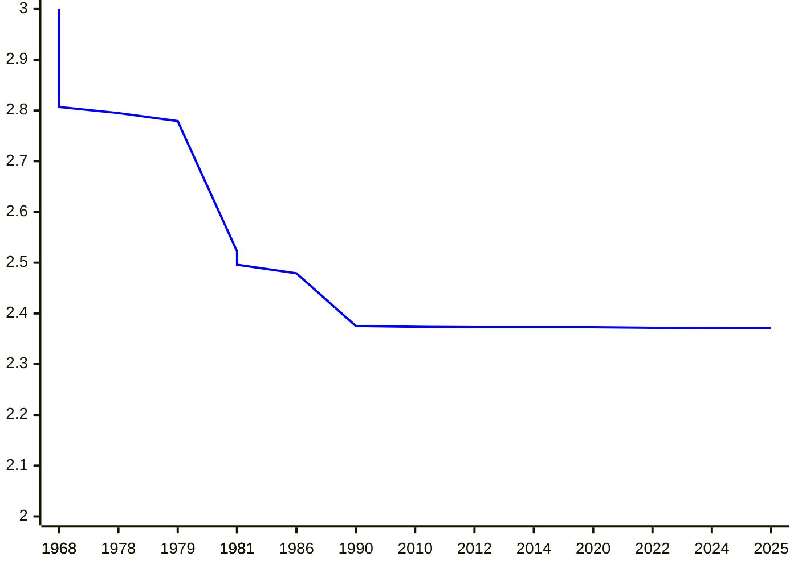

# Error-Correction of Matrix Multiplication Algorithms

Shuichi Hirahara (National Institute of Informatics)

[Nobutaka Shimizu](https://sites.google.com/view/nobutaka-shimizu/home) (Institute of Science Tokyo)

June 24th @STOC2025

---
layout: top-title
color: amber-light
---

::title::

# Matrix Multiplication

::content::

Given two matrices $A, B \in \F^{n\times n}$, compute their product $AB$ (over a finite field $\F$).

- A long line of works presented fast algorithms. <v-click> The exponent $\omega$ improves by **0.0046** over **35** years.</v-click>

| year | $\omega$ |  authors |
|:--:|:--|:--|
| 1968 | $2.807$ | [Strassen](https://link.springer.com/article/10.1007/BF02165411) |
| 1978 | $2.795$ | [Pan](https://ieeexplore.ieee.org/document/4567976) |
| 1979 | $2.779$ | [Bini, Capovani, Romani, Lotti](https://www.sciencedirect.com/science/article/pii/0020019079901133) |
| 1981 | $2.522$ | [Schönhage](https://epubs.siam.org/doi/10.1137/0210032) |
| 1981 | $2.517$ | [Romani](https://epubs.siam.org/doi/10.1137/0211020) |

|year | $\omega$ | authors |
|:--:|:--|:--|
| 1981 | $2.496$ | [Coppersmith, Winograd](https://ieeexplore.ieee.org/document/4568320) |
| 1986 | $2.479$ | [Strassen](https://ieeexplore.ieee.org/document/4568194) |
| **1990** | $2.3755$ | [Coppersmith, Winograd](https://www.sciencedirect.com/science/article/pii/S0747717108800132?via%3Dihub) |
| 2010 | $2.3737$ | [Stothers](https://era.ed.ac.uk/handle/1842/4734) |
| 2012 | $2.3729$ | [Williams](https://dl.acm.org/doi/10.1145/2213977.2214056) |

| year | $\omega$ | authors |
|:--:|:--|:--|
| 2014 | $2.3728639$ | [Le Gall](https://dl.acm.org/doi/10.1145/2608628.2627493) |
| 2020 | $2.3728596$ | [Alman, Williams](https://theoretics.episciences.org/14213) |
| 2022 | $2.371866$ | [Duan, Wu, Zhou](https://ieeexplore.ieee.org/document/10353208) |
| 2024 | $2.371552$ | [Williams, Xu, Xu, and Zhou](https://epubs.siam.org/doi/10.1137/1.9781611977912.134) |
| **2025** | $2.371339$ | [Alman, Duan, Williams, Xu, Xu, and Zhou](https://epubs.siam.org/doi/10.1137/1.9781611978322.63) |

  
---
layout: top-title
color: amber-light
---

::title::

# Computational Complexity of Matrix Multiplication

::content::

---
layout: top-title
color: amber-light
---

::title::

# Computational Complexity of Matrix Multiplication

::content::

If the current improvement rate (0.0046 / 35 yrs) continues, we need 3122 more years to reach $O(n^2)$ time.

<figure>

</figure>

---
layout: top-title
color: amber-light
---

::title::

# Approximate Matrix Multiplication

::content::

Given two **random** matrices $A,B\sim\F^{n\times n}$ as input, compute any matrix $C\in\F^{n\times n}$ that agrees with $AB$ on at least $\textcolor{c2185b}{\alpha}\cdot n^2$.

<v-clicks>

- $\alpha = 1$: the usual (average-case) matrix multiplication

- $\alpha = \frac{1}{\abs{\F}}$ is easy (just output the all-zero matrix)

- "Non-trivial algorithm": achieves $\alpha \ge \frac{1}{\abs{\F}} + \varepsilon$

Can we achieve a non-trivial $\alpha$ in $\widetilde{O}(n^2)$ time?

- $\widetilde{O}(\cdot)$ hides a $\polylog(n)$ factor.

</v-clicks>

---
layout: top-title
color: amber-light
---

::title::

# Problem Setting (Formal)

::content::

The **agreement** of two matrices $C,D\in\mathbb{F}^{n\times n}$ is defined as

$$
  \begin{align*}
    \agr(C,D) &:= \Pr_{i,j\sim[n]}[C(i,j) = D(i,j)].
  \end{align*}
$$

<v-clicks>

- **Approximate Matrix Multiplication**: Given $A,B\in\mathbb{F}^{n\times n}$, compute a matrix $C$ such that $\agr(C,AB)\ge \alpha$.
- An algorithm $M$ is said to have **average agreement $\alpha$** if it satisfies
$$
\Exp_{A,B\sim\mathbb{F}^{n\times n}}[\agr(M(A,B),AB)] = \Pr_{\substack{A,B\sim[n]\\ i,j\sim[n]}}[M(A,B)_{i,j}=(AB)_{i,j}]\ge \alpha.
$$
 
- Given $M$ as oracle, it is easy to estimate $\alpha$.
- When $\alpha=1$, all entries are computed correctly for all instances.

</v-clicks>

---
layout: top-title
color: amber-light
---

::title::

# Main Result 1: Uniform Reduction

::content::

For any $\alpha\in(0,1]$, consider a finite field of size $\abs{\F}>10n/\alpha^2$.
If there exists a $T(n)$-time algorithm with average agreement $\alpha$,
then there exists a $\widetilde{O}(T(n)\poly(1/\alpha) \cdot \log(\abs{\F}))$-time algorithm that solves matrix multiplication over $\F$.

- **worst-case-to-average-case** and **approximate-to-exact** reduction

<v-clicks>

Let $\varepsilon\in(0,1]$ be a constant and $\F$ be any finite field $\F$ of constant prime size.
If there exists a $T(n)$-time algorithm with average agreement $\alpha\ge \frac{2}{\abs{\F}}+\varepsilon$,
then there exists a $\widetilde{O}_{\abs{\F},\varepsilon}(T(n))$-time algorithm that solves matrix multiplication over $\F$.

- Hidden constant factor is extremely large: $2^{2^{\poly(\abs{\F}/\varepsilon)}}$
- $\alpha$ is not optimal

</v-clicks>

---
layout: top-title
color: amber-light
---

::title::

# Main Result 2: Nonuniform Reduction

::content::

Let $\varepsilon\in(0,1]$ be a constant and $\F$ be any finite field $\F$ of constant prime size.
If there exists a circuit $C$ of size $S$ that has average agreement $\alpha\ge \frac{1}{p}+\varepsilon$,
then there exists a circuit $C'$ of size $\widetilde{O}_{p,\varepsilon}(S)$ that solves matrix multiplication over $\F$.

Moreover, we can construct $C'$ in time $O_{p,\varepsilon}(n^3)$.

<v-clicks>

- Reduction with poly-time preprocessing
- Optimal agreement at the cost of nonuniformity
- hidden constant is $O(p\cdot \poly(1/\varepsilon))$
- Proof is based on XOR Lemma (average-case complexity)

</v-clicks>

---
layout: top-title
color: amber-light
---

::title::

# Related Results

::content::

- <a class="cite-reference" href="https://drops.dagstuhl.de/entities/document/10.4230/LIPIcs.APPROX/RANDOM.2024.34">\[Gola, Shinkar, Singh, RANDOM'24\]</a>
  - Similar result for $\F=\F_2$ under **one-sided error** setting (our result: two-sided error)
  - $\exists$ algo with $\alpha>\frac{8}{9}$ $\Rightarrow$ $\exists$ algo with $\alpha=1$

<v-clicks>

- <a href="https://link.springer.com/article/10.1007/s00453-016-0202-3" class="cite-reference">\[Gąsieniec, Levcopoulos, Lingas, Pagh, Tokuyama, Algorithmica'17 \]</a>
  - Computing $AB$ given $A,B,C\in\F^{n\times n}$ such that $\agr(AB,C)\ge 1-1/n$ 
  - More restrictive setting than ours but $\alpha$ must be very close to $1$

- Worst-case to average-case reductions (all entries but random input)
  - <a href="https://www.sciencedirect.com/science/article/pii/002200009390044W?via%3Dihub" class="cite-reference">\[Blum, Luby, Rubinfeld, JCSS'93\]</a>
  - <a href="https://dl.acm.org/doi/10.1145/3519935.3520041" class="cite-reference">\[Asadi, Golovnev, Gur, Shinkar, STOC'22\]</a>
  - <a href="https://dl.acm.org/doi/10.1145/3564246.3585189" class="cite-reference">\[Hirahara, Shimizu, STOC'23\]</a>

</v-clicks>

---
layout: top-title
color: amber-light
---

::title::

# Motivation

::content::

- Theoretically fast algorithms are not practical due to heavy constant factors.
- Emerge of fast algorithms utilizing **physical system**

---
layout: top-title
color: amber-light
---

::title::

# Problem Setting (Formal)

::content::

The **agreement** of two matrices $A,B\in\F^{n\times n}$ is defined as

$$
  \begin{align*}
    \agr(A,B) &:= \Pr_{i,j\sim[n]}[A(i,j) = B(i,j)]
  \end{align*}
$$

Such a matrix $A$ is called an **$\alpha$-agreement** of $B$.

We start with an algorithm $M$ such that

$$
  \begin{align*}
    \Exp_{\substack{A,B\sim\F^{n\times n} \\ M}}[\agr(M(A,B),AB)] &\ge \alpha
  \end{align*}
$$

Our goal: worst-case solver with almost the same running time as $M$

---
layout: top-title
color: amber-light
---

::title::

# Our Result (1/3): Large Field

::content::

Suppose $p > 10/\alpha$.
If there exists an algorithm $M$ that runs in time $T(n)$ and and satisfies
$$
  \begin{align*}
    \Exp_{\substack{A,B\sim\F^{n\times n} \\ M}}[\agr(M(A,B),AB)] &\ge \alpha,
  \end{align*}
$$

then there exists a $T(n)\cdot\polylog(n)\cdot \poly(1/\alpha)$-time algorithm $M'$ that satisfies

$$
  \begin{align*}
    {}^{\forall}A,B\in\F^{n\times n}, \quad \Pr_{M'}[M'(A,B)=AB] \ge \frac{2}{3}.
  \end{align*}
$$

- <a href="https://arxiv.org/abs/2305.13945" class="cite-reference">\[Gola, Shinkar, Singh, RANDOM'24\]</a> gave the same reduction for $\alpha > 7/8$
- If $\F$ is large enough, we can error-correct a large fraction (say, 99\%) of errors.
- Proof is based on ECC (Reed-Solomon code)

---
layout: top-title
color: amber-light
---

::title::

# Our Result (2/3): Small Field

::content::

If there exists an algorithm $M$ that runs in time $T(n)$ and and satisfies
$$
  \begin{align*}
    \Exp_{\substack{A,B\sim\F^{n\times n} \\ M}}[\agr(M(A,B),AB)] &\ge \frac{2}{p}+\varepsilon,
  \end{align*}
$$

then there exists a $O_{p,\varepsilon}(T(n)\cdot\polylog(n))$-time algorithm $M'$ that satisfies

$$
  \begin{align*}
    {}^{\forall}A,B\in\F^{n\times n}, \quad \Pr_{M'}[M'(A,B)=AB] \ge \frac{2}{3}.
  \end{align*}
$$

- Hidden constant factor in $O_{p,\varepsilon}(\cdot)$ is quite large (roughly $p^{\poly(p,1/\varepsilon)}$)
- Agreement is optimal up to factor two (random matrix achieves $1/p$-agreement)

---
layout: top-title
color: amber-light
---

::title::

# Our Result (3/3): Nonuniform Reduction

::content::

If there exists an algorithm $M$ that runs in time $T(n)$ and and satisfies

$$
  \begin{align*}
    \Exp_{\substack{A,B\sim\F^{n\times n} \\ M}}[\agr(M(A,B),AB)] &\ge \frac{1}{p}+\varepsilon,
  \end{align*}
$$

then, in time $O_{p,\varepsilon}(n^3)$, we can construct a size-$T(n)\cdot\poly(\log n,p,1/\varepsilon)$ circuit $M'$ that satisfies

$$
  \begin{align*}
    {}^{\forall}A,B\in\F^{n\times n}, \quad \Pr_{M'}[M'(A,B)=AB] &\ge \frac{2}{3}.
  \end{align*}
$$

- Reduction with poly-time preprocessing
- Optimal agreement at the cost of nonuniformity
- Proof is based on XOR Lemma (average-case complexity)

---
layout: top-title
color: amber-light
---

::title::

# Related work

::content::

- <a href="https://arxiv.org/abs/2305.13945" class="cite-reference">\[Gola, Shinkar, Singh, RANDOM'24\]</a> gave the same reduction for $\alpha > 7/8$
  - They also gave a reduction for $p=2$ and $\alpha=1/2+\varepsilon$ under the assumption that $M$ has **one-sided** error (it satisfies $M(A,B)_{i,j}=1$ whenever $(AB)_{i,j}=1$)
  - Our reduction: $M$ can have two-sided error but is need a preprocessing
- <a href="https://link.springer.com/article/10.1007/s00453-016-0202-3" class="cite-reference">\[Gąsieniec, Levcopoulos, Lingas, Pagh, Tokuyama, Algorithmica'17 \]</a> showed how to compute $AB$ given three matrices $A,B,C\in\F^{n\times n}$ such that $\agr(AB,C)\ge 1-1/n$.
  - $n$ entries can be wrong (our reduction allows, say, $0.99n^2$ errors)
  - Their setting is more restrictive than ours (we are allowed to query the product of random matrices for many times)

---
layout: top-title
color: amber-light
---

::title::

# Additional Remark

::content::

- We believe that our nonuniform reduction is **practical** if $\abs{\F}$ is small
  - running time overhead is $p\cdot \poly(1/\varepsilon) \cdot \log n$
  - simple and thus hidden constant factor is reasonably small
- Our uniform reductions are based on **efficiently encodable/list-decodable codes** with linear rate
  - specifically, we use Reed-Solomon codes and expander-based codes
  - If the code admit a practical list-decoding algorithm, then our reduction is also practical
  
---
layout: section
color: amber-light
---

# Proof of Uniform Reduction

---
layout: top-title
color: amber-light
---

::title::

# Idea: Matrix Encoding

::content::

- Suppose we have an algorithm $M$ that computes an $\alpha$-agreement of $AB$ for **arbitrary** $A,B\in\F^{n\times n}$.
  - We would like to compute $AB$ for any $A,B\in\F^{n\times n}$
- Given two matrices $A,B \in \F^{n\times n}$, we **encode** them using $\Enc\colon \F^{n\times n} \to \F^{N\times N}$
- Compute $\widetilde{C} = M(\Enc(A),\Enc(B))$. Note that $\widetilde{C}$ an $\alpha$-agreement of $\Enc(A)\cdot \Enc(B)$.

- **Suppose that $\Enc(A)\cdot \Enc(B) \in \F^{N\times N}$ is an encoding of $AB$ of a list-decodable ECC**
  - i.e., we can write $\Enc(A)\cdot \Enc(B) = \Enc'(AB)$ for some nice $\Enc'\colon\F^{n\times n}\to\F^{N\times N}$
- Then, we can obtain a list containing $AB$ by list-decoding $M(\Enc(A),\Enc(B))$
  - We can identify $AB$ from the list by checking if $AB=C$ using Freivalds' randomized algorithm

  Is there such $\Enc$ and $\Enc'$?

---
layout: top-title
color: amber-light
---

::title::

# Basic of Error-Correcting Codes

::content::

- An **encoding function** is a linear map $\Enc\colon \F^n \to \F^N$ for $N\ge n$
  - The image $C = \Enc(\F^k)$ is called a **code** and $x\in C$ is called a **codeword**
  - **distance** = $\min_{x,y\in C,x\ne y} \dist(x,y)$
    - $\dist(\cdot,\cdot)$ is the normalized Hamming distance
- For $x\in \F^N$ and $\rho\in[0,1]$, let $\ball(x,\rho)=\{ y\in\F^N \colon \dist(x,y)\le\rho \}$

  **list-decoding.**
  Given $x\in\F^N$, compute all vectors in $C\cap \ball(x,\rho)$.

- $\#$ of codewords in $\ball(x,\rho)$?
- fast algorithm?